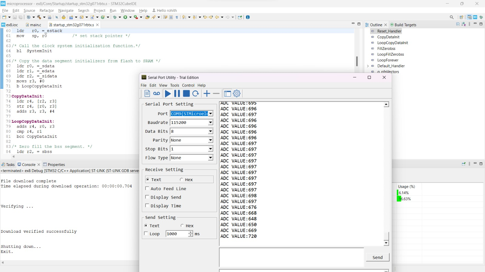
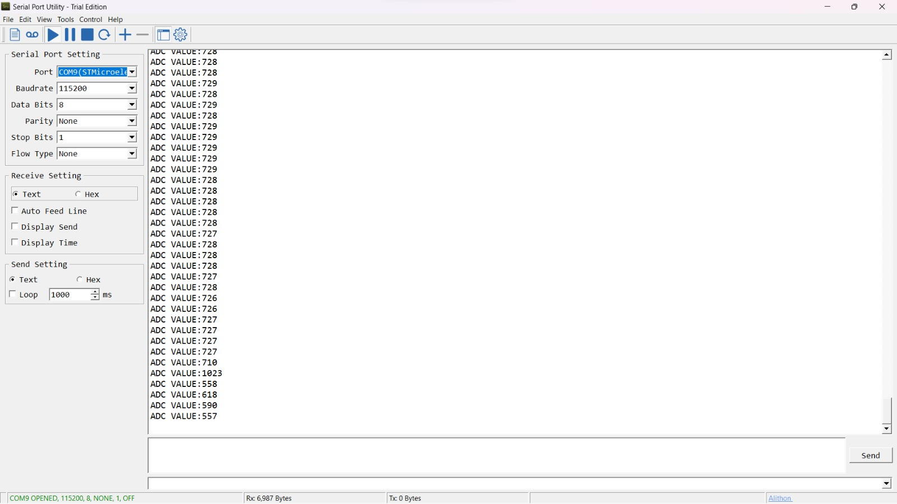

### Ex. No. :8 CONFIGURING ANALOG PORT TO INTEFACE AN ANALOG SENSOR AND READ THE VALUES USING SERIAL PORT
## Date: 
###  

## Aim: 
To configure ADC channel for interfacing an analog sensor and read the values on the com port 
## Components required:
STM 32 CUBE IDE , STM32 NUCLEO BOARD, CONNECTING CABLE, SERIAL PORT UTILITY , ANALOG SENSOR - 3.3V TYPE 
 ## Theory 

 
ADCs are characterized by:

Resolution [bit]: the number of bits to represent a digital signal.
Sampling rate [Hz]: how fast they work.

ADC Symbol. 
An 10-bit ADC with 1 kHz sampling rate has 256 (2⁸) levels in its digital signal and takes 1 millisecond to convert an analog signal into its digital form.


An analog signal is expressed in voltage [V] and other important features are:

Full-scale voltage: the maximum input voltage value convertible into digital.
Voltage resolution (Quantum): equal to its full-scale voltage divided by the number of levels.
An 8-bit ADC with 3.3V of full-scale voltage has a quantum equal to: 3.3V / 256 levels = 12.9mV.
The quantum is the minimum voltage value that ADC can discretize. When an analog value being sampled falls between two digital levels the analog signal will be represented by the nearest digital value. This causes a very slight error called “quantization error”.

Different Ways To Read STM32 ADC   
 

1 – The Polling Method

It’s the easiest way in code in order to perform an analog to digital conversion using the ADC on an analog input channel. However, it’s not an efficient way in all cases as it’s considered to be a blocking way of using the ADC. As in this way, we start the A/D conversion and wait for the ADC until it completes the conversion so the CPU can resume processing the main code.

2 – The Interrupt Method

The interrupt method is an efficient way to do ADC conversion in a non-blocking manner, so the CPU can resume executing the main code routine until the ADC completes the conversion and fires an interrupt signal so the CPU can switch to the ISR context and save the conversion results for further processing.

However, when you’re dealing with multiple channels in a circular mode or so, you’ll have periodic interrupts from the ADC that are too much for the CPU to handle. This will introduce jitter injection and interrupt latency and all sorts of timing issues to the system. This can be avoided by using DMA.

3 – The DMA Method

Lastly, the DMA method is the most efficient way of converting multiple ADC channels at very high rates and still transfers the results to the memory without CPU intervention which is so cool and time-saving technique.

 

The STM32 Nucleo Board
The STM32 development board in use belongs to the NUCLEO family: the NUCLEO-G431RB is equipped with an STM32G431RB microcontroller, led, buttons, and connectors (Arduino shield compatible). It provides an easy and fast way to build prototypes.


STM32 NUCLEO-G431RB development board.  
The STM32G071RB is a mainstream ARM Cortex-M4 microcontroller with 128KB flash memory, most common communication interfaces (I2C, SPI, UART, …), and peripherals (ADC, DAC, PWM, Timer, …).


SOIL MOISTURE SENSOR 
Calculations
Capacity is calculated using the following expression:


Let the plates have dimensions  w  = 12 mm; l  = 35 mm, then the area S  = 12*35 = 420 mm², and the distance between them d  = 3 mm, then the calculated electrical capacitance C =  1 pF .

Capacitance calculation (dielectric: air)
The geometric dimensions (area) S , as well as the distance between the plates d , do not change. To change the capacitance, it remains to change the substance between the plates, as long as it is air ε = 1 . What do you think? relative dielectric constant  of water ? Sources show ε = 81 .

Capacitance calculation (dielectric: water)
Full immersion in water will increase the capacity by 81 times ! The calculated capacitance C will no longer be 1 pF, but  100 pF .


Thus, by smoothly immersing this homemade condenser, the capacity will also smoothly and proportionally change, which makes it possible to effectively monitor the state of humidity.

Converting a change in capacitance into a change in voltage
By connecting a capacitor in series with a resistor, we obtain a low-pass filter ( LPF ).


This results in a voltage divider where the resistance of the upper arm R1 does not change, but the capacitance of the lower arm C1 changes depending on the frequency.


But since the signal frequency will remain unchanged, we will plot the dependence of capacitance on capacitance ( C = 1-100 pF):
  

  
 ## Procedure:

Open STM32CubeIDE Software and go to File → New… → STM32 Project.
Click on Board Selector and select NUCLEO-G431RB in the dropdown menu.

Board selector section. Image by author.
Insert a project name and select STM32Cube as Targeted Project Type.

Setup STM32 project. Image by author.
After creating the project, a page will appear showing all the necessary features needed to configure the MCU.

STM32Cube device configuration. 
The STM32G071RB has 2 ADCs (named ADC1 and ADC2) with a maximum sampling rate of 4MHz (0.25us) and up to 19 multiplexed channels. Resolution of 12-bit with a full-scale voltage range of up to 3.6V.
With channels, it is possible to organize the conversions in a group. A group consists of a sequence of conversions that can be done on any channel and in any order, also with different sampling rates.

The Analog connector of the development board is connected to pins: PA0, PA1, PA4, PB0, PC1, and PC0 of the microcontroller.


Pinout of the analog connector — NUCLEO-G071RB. .
The potentiometer is wired to the PA0 pin and so the ADC1 Channel 0 (ADC1_IN0) will be used to convert the analog value.

Open the Pinout&Configuration tab and click on Analog → ADC1 in the Categories section.
In the channel 1 (IN0) dropdown menu select Single-ended.
The ADC can be configured to measure the voltage difference between one pin and the ground (Single-ended configuration) or between two pins (Differential configuration).


ADC1 mode panel.  
Leave the ADC1 Configuration panel with the default values and save the project.
* Clock prescaler: Synchronous clock mode divided by 4
ADC Clock derives from the system clock (SYCLK) that is set to the maximum frequency: 170MHz.
Divide by 4 means to set the maximum ADC sampling frequency (170MHz/4 = 42.5MHz).
* Resolution: ADC 10-bit resolution
Output digital signal has 1024 levels. The voltage full-scale range is equal to the microcontroller supply voltage (3.3V).

ADC1 configuration panel.  .
After saving the configuration, the STM32CubeIDE will generate all the project files according to the user inputs.

The soil moisture sensor is one kind of sensor used to gauge the volumetric content of water within the soil. As the straight gravimetric dimension of soil moisture needs eliminating, drying, as well as sample weighting. These sensors measure the volumetric water content not directly with the help of some other rules of soil like dielectric constant, electrical resistance, otherwise interaction with neutrons, and replacement of the moisture content.

The relation among the calculated property as well as moisture of soil should be adjusted & may change based on ecological factors like temperature, type of soil, otherwise electric conductivity. The microwave emission which is reflected can be influenced by the moisture of soil as well as mainly used in agriculture and remote sensing within hydrology.


soil-moisture-sensor-device
soil-moisture-sensor-device
These sensors normally used to check volumetric water content, and another group of sensors calculates a new property of moisture within soils named water potential. Generally, these sensors are named as soil water potential sensors which include gypsum blocks and tensiometer.

Soil Moisture Sensor Pin Configuration
The FC-28 soil moisture sensor includes 4-pins


soil-moisture-sensor
soil-moisture-sensor


VCC pin is used for power
A0 pin is an analog output
D0 pin is a digital output
GND pin is a Ground
This module also includes a potentiometer that will fix the threshold value, & the value can be evaluated by the comparator-LM393. The LED will turn on/off based on the threshold value.


##  Program 
```c
#include "main.h"
#include"stdio.h"
uint32_t adcvalue;
#if defined (__ICCARM__) || defined (__ARMCC_VERSION)
#define PUTCHAR_PROTOTYPE int fputc(int ch, FILE *f)
#elif defined(__GNUC__)

#define PUTCHAR_PROTOTYPE int __io_putchar(int ch)
#endif
int main(void)
{
  HAL_Init();
  SystemClock_Config();
  MX_GPIO_Init();
  MX_ADC1_Init();
  MX_USART2_UART_Init();
   while (1)
  {
	  HAL_ADC_Start(&hadc1);
	  			HAL_ADC_PollForConversion(&hadc1,100);
	  			adcvalue = HAL_ADC_GetValue(&hadc1);
	  			HAL_ADC_Stop(&hadc1);
	  			HAL_Delay(500);
	  			printf("ADC VALUE:%ld\n",adcvalue);
  }
  
}
PUTCHAR_PROTOTYPE
{

  HAL_UART_Transmit(&huart2, (uint8_t *)&ch, 1, 0xFFFF);

  return ch;
}
```

 
 
## Output  :




## Result :
Thus, the configuring analog port to interface an analog sensor and read the values using serial port is successfully executed.
